# TIMEBOXED: *Game Design Document*

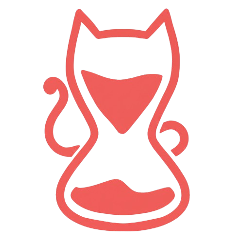

> **Equipo de desarrollo**:
> Alicia Sarahi Sanchez Varela 
> Oliver Garcia Aguado 
> Alexandra Lenta
> Zhiyi Zhou 

## 1 Resumen
### 1.1 Descripción
*Timeboxed* es un juego 2D para navegador que combina elementos de mitología, apuestas, juegos de azar y juegos de mesa con la presencia de gatos como protagonistas.

El jugador viaja en el tiempo a través de tres niveles ambientados en diferentes mitologías y participa en tres tipos de juegos apostando su alma contra los distintos dioses con el propósito de recuperar los objetos que un gato mágico ha perdido.

### 1.2 Género
Juegos de mesa en navegador.

**Estrategia**: se observa pacientemente la partida y se toma la oportunidad de realizar la mejor jugada posible.

**Simulación**: experimentación en primera persona de perder y ganar en un juego bajo la presión de poder perderlo todo.

**Aventura gráfica**: Exploración de eras pasadas, interacción con seres mitológicos y dominación de juegos tradicionales únicos.

### 1.3 Setting
Es un día normal para ti, un gato normal de un barrio normal, jugando en una calle vacía con una preciosa bola de hilo obtenida de un humano. De pronto, la bola desaparece ante tus propios bigotes.

Al seguir el rastro del responsable, consigues encontrar al felino sin vergüenza que te la robó y hacéis un trato: si le ayudas a recuperar tres objetos perdidos, te devolverá tu juguete.

Parece sencillo... hasta que descubres que tu misión implica viajar en el tiempo y apostar contra varios gato-dioses de la mitología...

**¿Podrás superar los desafíos y recuperar tu querida bola de hilo?**

### 1.4 Narrativa
Al comenzar a viajar por las eras, antes de conocer a nuestro oponente mitológico,Kronos introduce brevemente al jugador en el contexto del adversario al que se enfrentará. Antes de cada encuentro, Cronos comparte comentarios sobre el dios correspondiente, explicando su relación pasada y las circunstancias que llevaron a la pérdida del objeto. Estos diálogos no sólo proporcionan información narrativa, sino que también aportan matices sobre las características de Kronos y los dioses.

Los dioses mitológicos de cada era tendrán una personalidad distinta (e.g. uno se burlará de Kronos, otro pasa de todo, otro es muy depresivo, etc) que junto a las palabras de Kronos y el jugador, desencadenará la apuesta y el inicio del juego. El enfrentamiento con cada dios se traduce en una apuesta representada a través de un minijuego temático. La elección del tipo de juego depende del dios de la era, reforzando la conexión entre su cultura y la mecánica jugable.

Cada vez que recuperamos una posesión de kronos, nos contará su historia. Finalmente, tras recuperar el último objeto, cumple su promesa y devuelve al protagonista su bola de hilo. Sin embargo, desaparece inmediatamente después, dejando al jugador con la sensación de que la aventura ha alterado el curso del tiempo y que quizás Kronos no era del todo quien decía ser.

### 1.5 Características principales
**Contexto temático**: el juego se ambienta en diversas eras mitológicas, Roma, Egipto y Japón. Cada una de estas eras presentan personajes y símbolos propios de su cultura, con el objetivo de ofrecer una representación única y reconocible para el jugador.

La estructura del juego se organiza de forma no lineal, lo que permite al jugador elegir libremente el orden en que recorrerá las diferentes eras mitológicas.

Desde el punto de vista artístico, el juego adopta un estilo visual en 2D con líneas marcadas y sombreados mínimos, lo que aporta claridad a las ilustraciones, además, en cada era se incorporan elementos gráficos propios de su mitología.

Se plantea la incorporación de una banda sonora adaptada a cada mitología que refuerza la tensión de las apuestas.

## 2 Gameplay
### 2.1 Objetivo del juego
El objetivo principal del videojuego es recuperar los tres objetos que Kronos ha perdido en sus apuestas contra diferentes dioses a lo largo del tiempo. Cada uno de estos objetos se encuentra custodiado en una era mitológica distinta, lo que obliga al jugador a viajar entre ellas para completar su misión.

A nivel de objetivo a **largo plazo**, el jugador debe superar los desafíos en las tres eras disponibles y obtener los objetos perdidos. Una vez reunidos los tres, el videojuego se considera completado.

En cuanto a los objetivos a **medio plazo**, cada era plantea un enfrentamiento único contra el dios correspondiente. Para conseguir el objeto de esa etapa, el jugador debe vencer en el minijuego asignado a dicha mitología.

Los objetivos a **corto plazo** se centran en la resolución de cada partida en el momento.

El sistema de victoria y derrota está definido de manera simple: si el jugador gana la partida contra el dios, obtiene el objeto y avanza en la progresión general; si pierde, el minijuego se reinicia, debiendo volver a intentarlo hasta alcanzar la victoria.

### 2.2 Core loops
Este coreloop se repetiría un total de 3 veces a lo largo del contenido del juego:

1. El jugador viaja a una era del tiempo seleccionado.
2. El jugador conoce los dioses de esa era e inicia apuestas en forma de minijuegos. 
    - Si el jugador gana, obtiene el objeto y el ciclo concluye.
    - Si el jugador pierde, el minijuego se reinicia hasta obtener la victoria.
3. Se completa el ciclo en las 3 eras y se reúnen todos los objetos viajas a una era del tiempo.

## 3 Mecánicas
El juego consiste en ganar tres juegos inspirados en tres mitologías y culturas diferentes. El jugador podrá elegir el orden en el que jugarlos. Si pierde el juego, se muestra un final “malo” y el juego se reinicia. Si gana, puede pasar al siguiente juego, hasta terminarlos todos y ver el final “bueno” de la historia.

### 3.1 Tali – Mitología Romana
En este juego se decide el resultado con tiradas de dados. Hay 4 dados de 4 lados marcados con 1, 3, 4 y 6.

Ambos tiran un dado (el jugador pulsa el botón correspondiente). Empieza la persona con el mayor resultado y tira los 4 dados a la vez.

Hay 5 tiradas posibles, dependiendo del resultado de los dados, cada una con distinta puntuación.

**Tiradas**:
1. *Venus (5 puntos)*: todos los números de los dados son distintos entre sí.
2. *Marte (3 puntos)*: al menos un dado con el número 6.
3. *Júpiter (1 punto)*: todos los dados son el mismo número.
4. *Neptuno (0 puntos)*: todos los dados son 1.
5. *Luna (evento)*: hay al menos 3 dados con el número 3. En este caso, el jugador puede tirar otra vez.
Si 2 tiradas coinciden (por ejemplo, si el resultado es 1, 3, 4, 6, – Venus y Marte) se suma la puntuación de ambas.

El juego dura 3 rondas, y gana la persona con mayor puntuación.

**Layout del nivel**
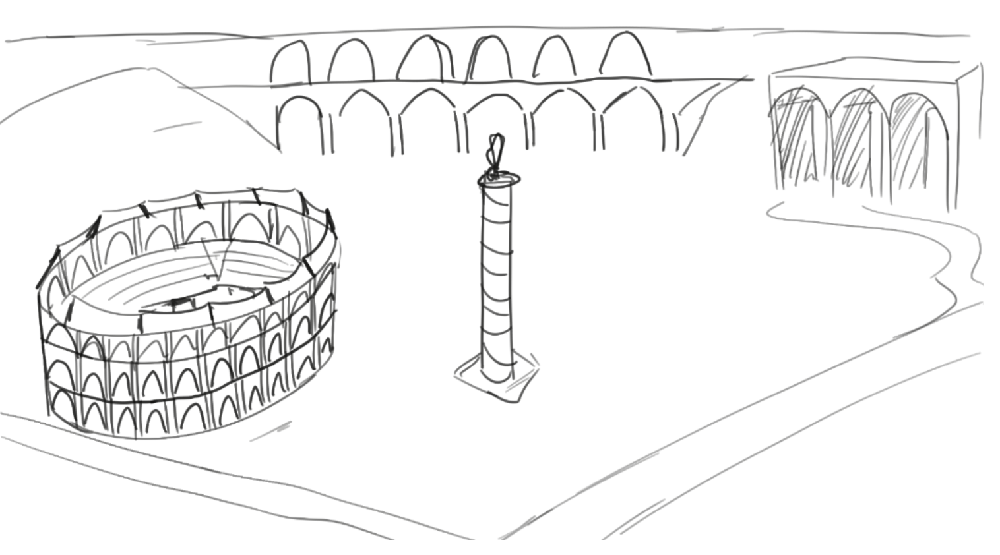
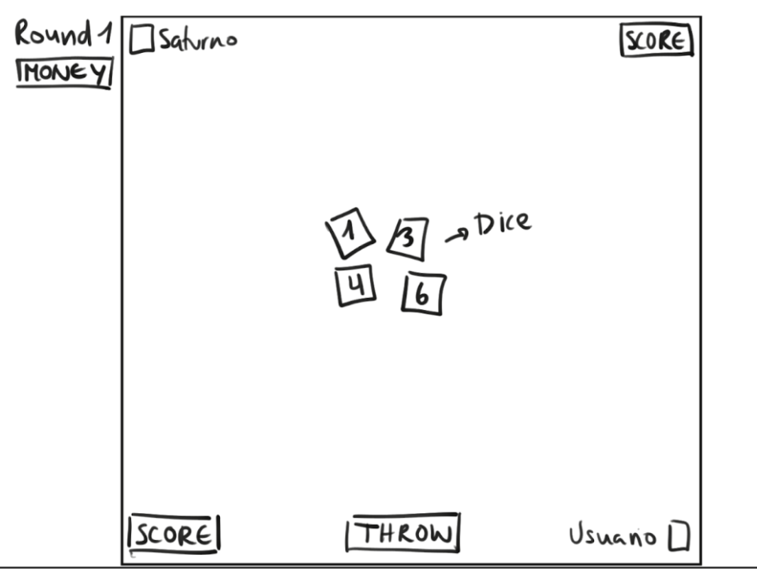

### 3.2 Hanafuda - Mitología japonesa
El Hanafuda se traduce como “Baraja de las Flores”, un juego de cartas tradicional japonés. Se compone de 48 naipes repartidos entre los 12 meses del calendario japonés. Cada mes se compone de un tema floral y de símbolos representativos de la naturaleza nipona a través de las estaciones del año.

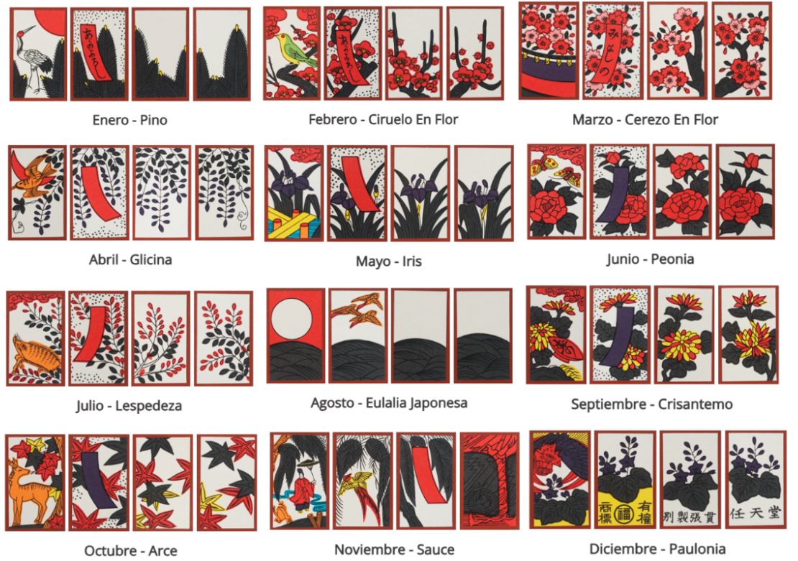

El objetivo del juego es conseguir el mayor número de puntos al final de 6 rondas, seleccionando cartas de la mesa y formando combinaciones con ellas.

Para decidir quién comienza el juego, ambos jugadores seleccionan una carta para tirar en la mesa. El que se aproxime más al primer mes comienza la partida.

Al empezar, se reparten las cartas de dos en dos, 8 por jugador y 8 sobre la mesa. El resto forma el mazo.

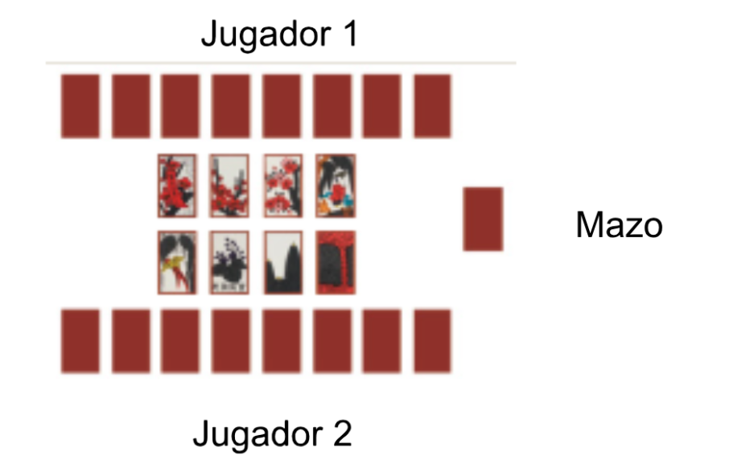

En su turno, el jugador debe formar un par de un mismo mes con una carta de su mano y otra de la mesa. Luego hace lo mismo con una carta del mazo.

Por último, cuando recupera el/los pares de cartas y se colocan a su lado. Se verifica si puede formar una combinación (*yaku*) con esas. Si no, pasa al turno del oponente. Si ha formado el yaku, puede detener la ronda y sumar los puntos o continuar con la partida.

La ronda termina cuando ambos jugadores han agotado sus 8 cartas y ninguno puede formar yaku, el turno se acaba con 0 puntos y se pasa a la ronda siguiente.

Al final de cada ronda, se anotan los puntos. Son 6 rondas en total. El jugador con la puntuación más alta gana.

**Yakus posibles:**

- Izanami (3 puntos): 3 cartas con el símbolo especial
- Kajin (3 puntos): 3 cartas con cinta
- Fujin (2 puntos): 5 cartas básicas (sin símbolo ni cinta)
- Dojin (2 punto): 3 cartas de 3 meses diferentes que forman una estación
- Ryujin (1 puntos): 4 cartas del mismo mes

**Layout del nivel:**
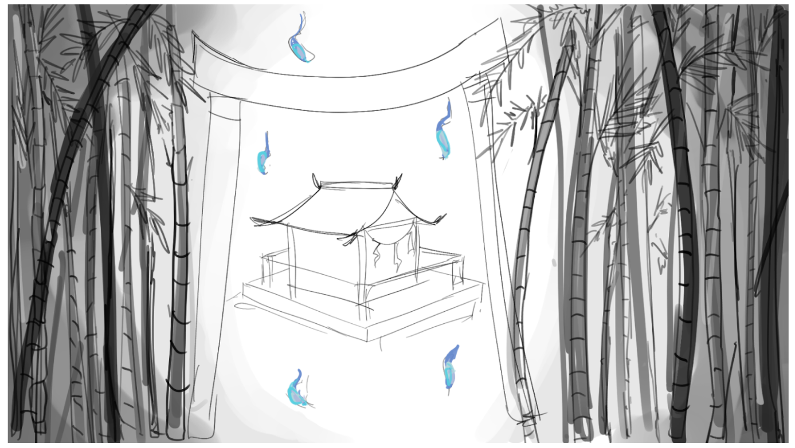
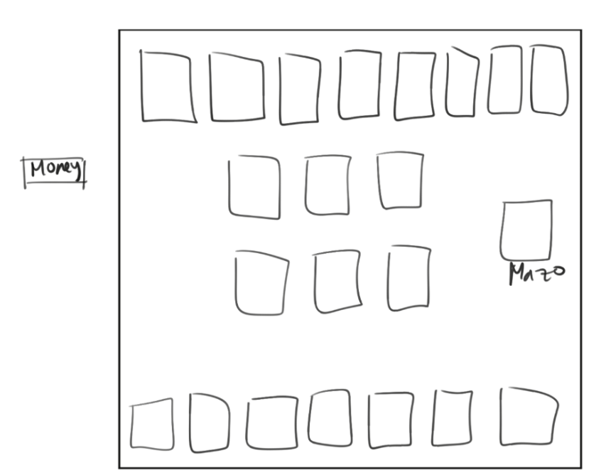

### 3.3 Aseb - Mitología Egipcia
Aseb es un juego del Egipto Antiguo que consiste en lanzar palos que sirven como dados y avanzar por un tablero y llevar todas tus piezas al final, parecido al parchís.

Cada jugador tiene 3 piezas.

Para decidir quién empieza, los jugadores tiran los dados (seleccionando el botón correspondiente). El que obtenga el resultado más alto empieza.

Puedes seleccionar cualquiera de tus piezas para mover esté o no sobre el tablero. Cada turno consiste en tirar dados y la pieza se moverá el número de casillas equivalentes al resultado de la tirada.

El recorrido comienza en el lado del jugador y avanza hacia la esquina. Desde ahí, las piezas continúan hacia la fila central en dirección opuesta hasta alcanzar la casilla final, donde deberán salir del tablero.

Las casillas especiales marcadas con cruz, otorgan una tirada adicional al jugador si logra situar una pieza en ellas. Para poder retirar una pieza del tablero, es necesario que la tirada sea exacta. Cuando se selecciona una pieza en el tablero, se da la opción de “retirar”.

Cada casilla puede ser ocupada únicamente por una pieza del mismo jugador, por lo que no es posible apilar fichas propias. En caso de que una pieza caiga sobre una casilla ocupada por el oponente, la ficha del oponente es devuelta al inicio de su recorrido y deberá comenzar de nuevo.

Si en un turno el resultado del dado no permite realizar ningún movimiento válido, el jugador pierde el turno automáticamente.

Para salir del tablero, se tiene que conseguir la tirada exacta que te deje en la última casilla. Si no se consigue una tirada así, el jugador tendrá que seleccionar otra pieza prar mover o dar por terminado su turno.

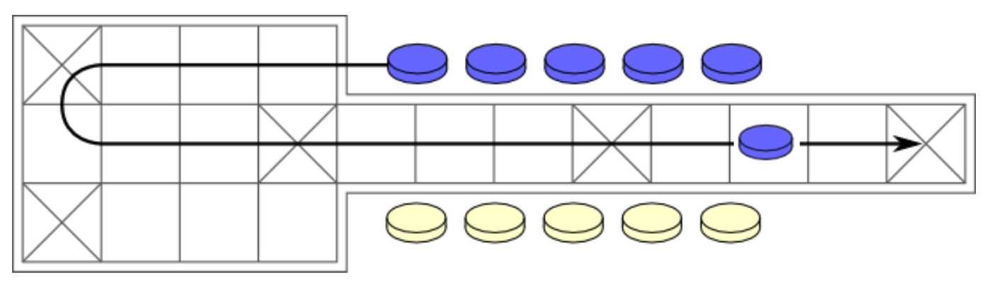

**Layout del nivel:**
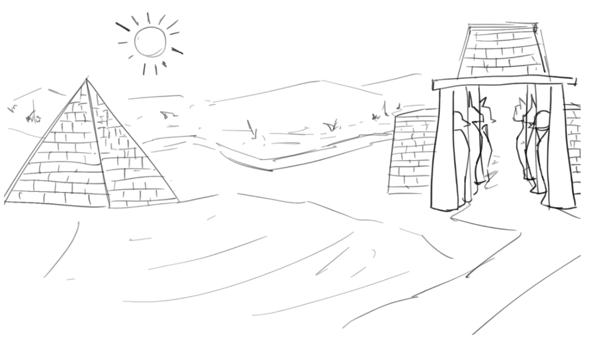
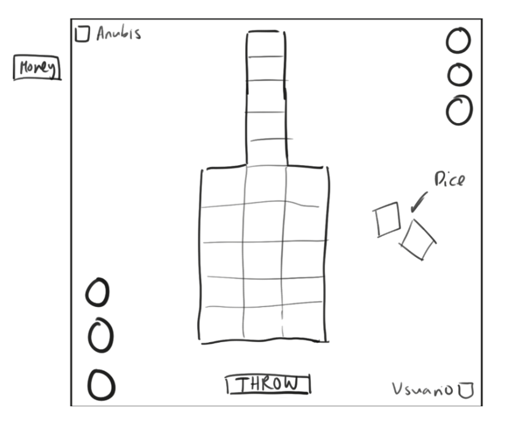

### 3.4 Modo TimeBoxed (Dificultad extra)
El modo TimeBoxed es una opción activable que altera el funcionamiento del juego en el siguiente aspecto:

Si el jugador tiene activada esa opción en su partida y tras un minijuego es derrotado, el espacio tiempo se corromperá provocando que el jugador tenga que iniciar el juego desde el inicio.

Completar el juego completo con esta opción le otorgará al jugador una insignia única.

## 4 Interfaz
### 4.1 Controles
El juego se controla a base de un teclado y ratón.

**Click/enter**: se utiliza para continuar o elegir opciones.

**Escape**: se utiliza para abrir el menú de pausa.

### 4.2 Cámara
La cámara del juego es fija, con una resolución de 1920x1080. Al ser un juego narrativo se ven los personajes y fondo, y al momento de jugar los juegos los personajes no aparecen.

### 4.3 HUD
Los objetos que vamos recuperando se colocarán a la derecha de la pantalla.

Los botones de Menú de pausa y de ayuda siempre estarán en pantalla.

Cuando se explican las reglas de juego o hay diálogos con NPCs aparecerá la imagen del NPC acompañado de la caja de diálogo.

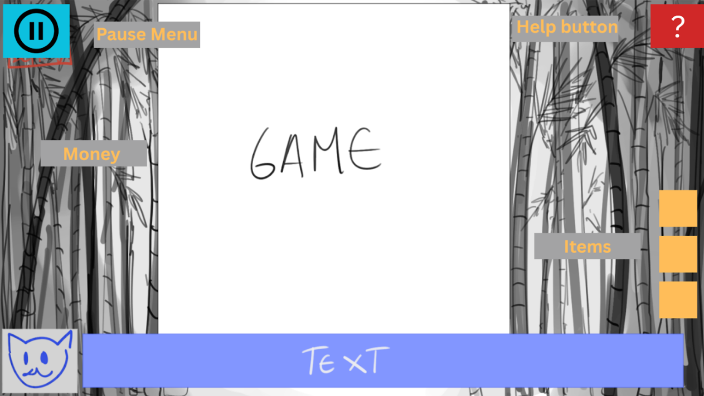

### 4.4 Menús
El primer menú es del Menú de Inicio, donde se tendrán las opciones de:
- Jugar
- Ajustes
- Créditos
- Al elegir la opción de jugar se abre el Menú de selección, donde el usuario podrá elegir el juego entre 3 opciones.

Al estar dentro del juego, se puede acceder al Menú de pausa seleccionando el botón correspondiente o con la tecla “Escape”, el cual tendrá opciones de:
- Continuar
- Ajustes
- Ayuda
- Salir

## 5 Mundo del juego
### 5.1 Personajes
**<ins>5.1.1 El jugador</ins>**
El protagonista es un gato doméstico de pelaje blanco y amarillo. Vive en un barrio ordinario y pasa el tiempo jugando con una bola de hilo obtenida de un humano. Su personalidad es despreocupada y juguetona, pero se ve envuelto en una aventura cuando su juguete desaparece. De pronto se convierte en un héroe involuntario que se convierte en el encargado de recuperar los objetos perdidos de Kronos a cambio de su propia bola de hilo.

Es controlado por el jugador, puede desplazarse entre eras, interactuar con NPCs y participar en los minijuegos de apuestas.

**<ins>5.1.2 Kronos</ins>**
Kronos es un gato de porte majestuoso con rasgos que transmiten tanto autoridad, como despreocupación y picardía. Es el dios del tiempo que ha perdido tres de sus objetos más preciados en apuestas con deidades de otras culturas. Con astucia, roba la bola de hilo del protagonista para forzar su cooperación en la misión de recuperación.

Es el NPC central que guía, manipula y motiva al jugador, expone objetivos al jugador antes de cada partida, explica las reglas de los juegos y, recuerda constantemente que aún quedan objetos por recuperar.

**<ins>5.1.3 Dioses mitológicos</ins>**
Cada era presenta un dios felino inspirado en la cultura correspondiente. Aunque se adaptan a la iconografía propia de cada mitología, todos son representados como gatos divinos.

Son custodios de los objetos perdidos de Kronos y son antagonistas temporales que desafían al jugador en un minijuego específico.

### 5.2 Objetos
**5.2.1 Lata de Atún**
Se obtiene en la era romana.
**5.2.2 Pin con Logo**
Se obtiene en la era egipcia.
**5.2.3 Cascabel**
Se obtiene en la era japonesa.

### 5.3 Insignias
**5.4.1 Complete the game**
Recupera los objetos de kronos y tu bola de hilo.
**5.4.2 Stick King**
Gana el juego de Aseb y recupera el “Pin”.
**5.4.3 Underworld Conqueror**
Gana el juego de Aseb y cae en todas las casillas especiales en la misma partida.
**5.4.4 Square Master**
Gana el juego de Aseb sin tener ninguna de tus piezas capturadas.
**5.4.5 Challenge and Win against Mercury**
Gana el juego de Tali y recupera la “lata de atún”.
**5.4.6 [to be added]**
Gana el juego de Tali habiendo distraido a Mercury tres veces.
**5.4.6 Challenge and Win against Benten**
Gana el juego de Tali y recupera el “cascabel”.
**5.4.7 Complete the game in Timeboxed mode.**
Gana el juego con el modo Timeboxed encendido.

## 6 Experiencia de juego

Una partida en Timeboxed comienza con el jugador en la piel de su gato protagonista, recibiendo la introducción de Kronos para recuperar los objetos perdidos. Tras seleccionar una de las eras mitológicas, la narrativa transporta al jugador a un escenario temático en 2D, con estética estilizada adaptada a la cultura correspondiente.

En cada era, el jugador se encuentra con el dios felino local, que plantea un reto bajo la forma de un minijuego de apuestas. Antes de comenzar, se muestra un breve intercambio de diálogo que establece el tono y el desafío del juego. Una vez iniciada la partida, la dinámica entra en un bucle de turnos alternos entre jugador y adversario.

El jugador progresa superando cada enfrentamiento. En caso de derrota, el minijuego se reinicia, manteniendo la presión de tener que arriesgar su alma para continuar. En caso de victoria, se obtiene uno de los objetos perdidos de Kronos y se regresa al ciclo principal.

El flujo completo de la experiencia consiste en repetir esta estructura en tres eras distintas, con sus respectivos minijuegos, hasta reunir los tres objetos y concluir la misión.

## 7 Estética y contenido
Estilo artístico de personajes basado en la cultura de manga y anime. Estilo de paisaje basado en estilo de pinceladas y concept art.

La música de cada minijuego se basa en cada mitología y cultura. La música del juego es tranquila.

Al conseguir uno de los objetos objetivos se provoca un efecto de luz.

## 8 Referencias
**Persona Series**
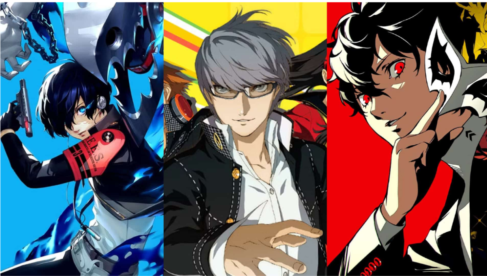
**Professor Layton**
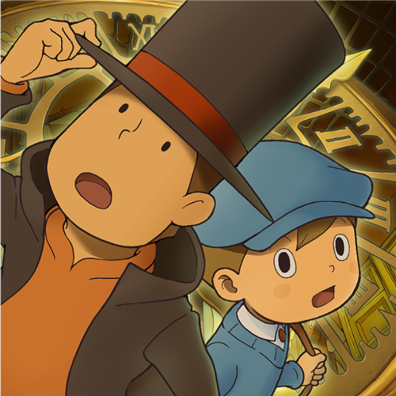
**Later Alligator**
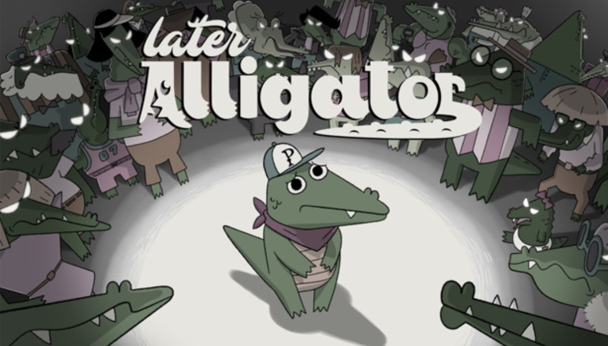