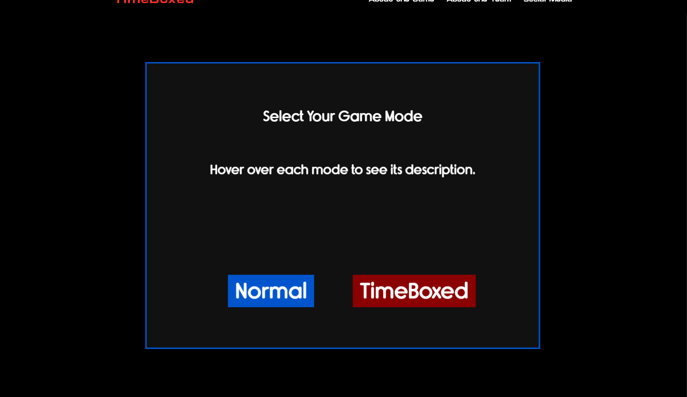
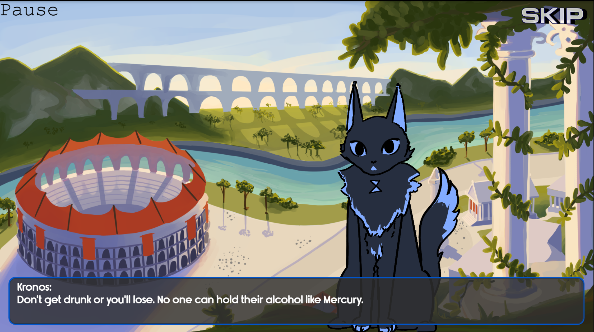
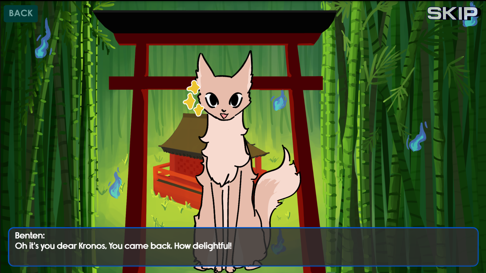
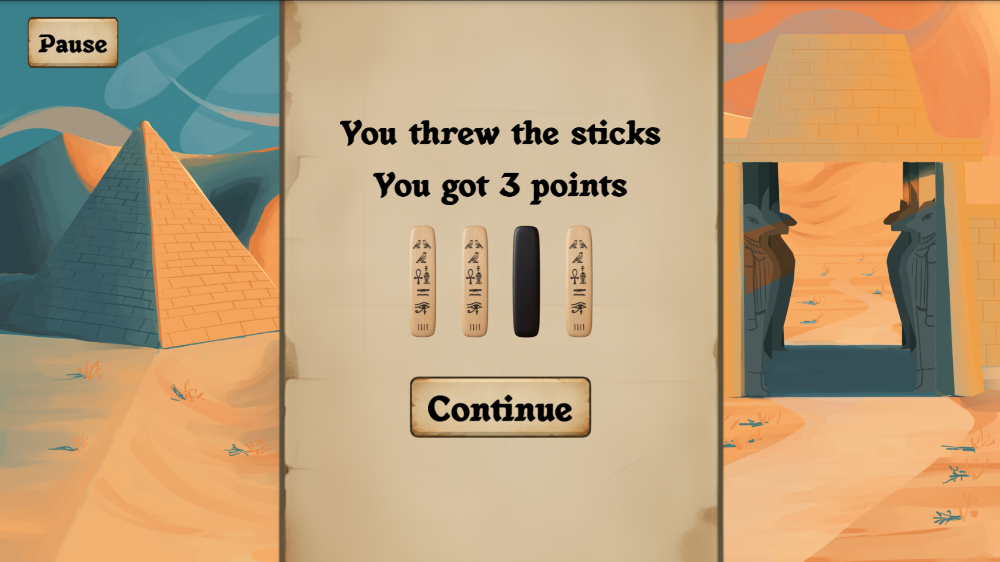
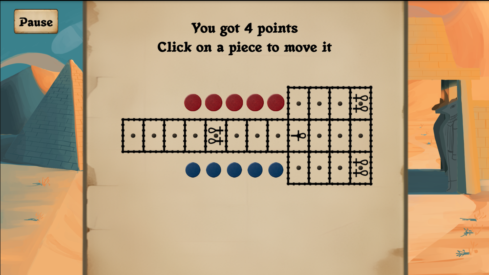
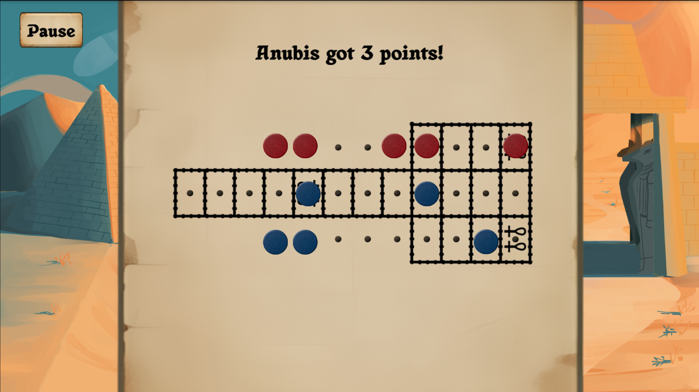
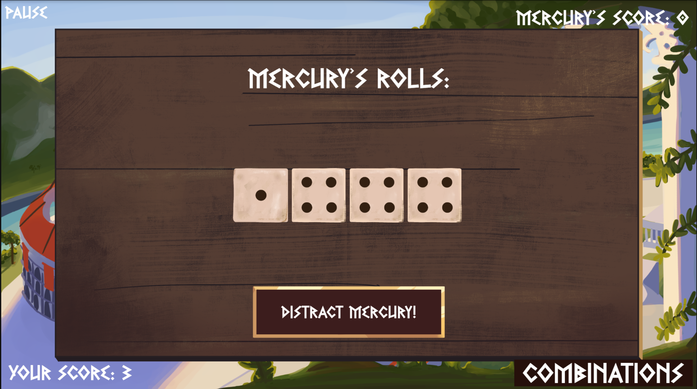
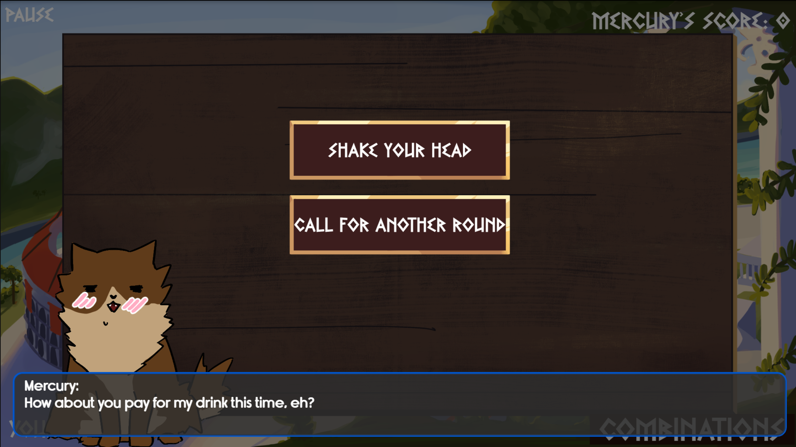

# Timeboxed

> Proyecto universitario desarrollado como parte de la asignatura de Programación de videojuegos en lenguajes interpretados

## Sobre el proyecto

**TimeBoxed** es una aventura única con gatos que combina la profundidad estratégica de los juegos de mesa con la emoción de los viajes en el tiempo. En este viaje, atravesarás diferentes épocas y lucharás contra diferentes dioses mitológicos.

### Capturas del juego
#### Start Menu

#### Pause Menu

#### Timeboxed Mode

#### Logros

#### Diálogo

#### Aseb

#### Tali

#### Hanafuda

## Versión jugable
**https://maltengd.github.io/TimeBoxed/**

## Nuestro Twitter

[Twitter/X](https://x.com/PopCatGames)

## Detalles técnicos
**Motor :** Phaser 3 (JavaScript)

**Plataforma :** Navegador web

## Equipo
- [Alicia Sarahi Sanchez Varela](https://github.com/Allbeth2)
- [Alexandra Lenta](https://github.com/AlexaLen1)
- [Oliver Garcia Aguado](https://github.com/MaltenGD)
- [Zhiyi Zhou](https://github.com/Zhiyi1223)

## Licencia
Este proyecto se realizó con fines educativos como parte del curso universitario.  
