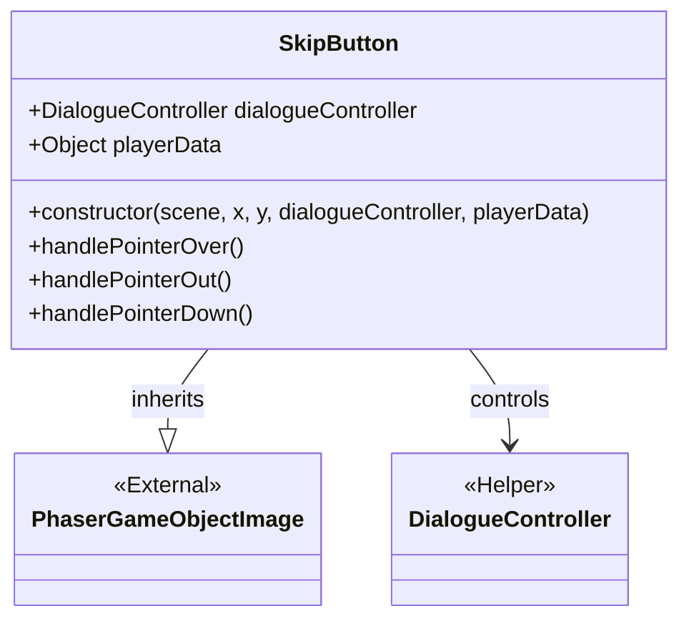
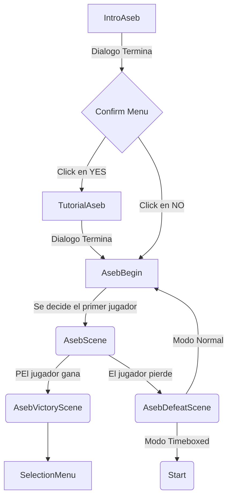

# Arquitectura de Timeboxed
## Clases generales
**DialogueController**

**TransitionController**

Controller de transiciones.

**SkipButton**

Controller/Helper del DialogueController.

**AchievementManager**

Manager para los logros.

**RandomNumber**

Tiene solo un método estático que devuelve un número aleatorio dentro del intervalo dado.

## Escenas

### Base Scene

### Loading Scene

### Intro

### Start

### Credits Scene

### Settings Scene

### Option Menu Scene

### Help Lobby Scene

### Items Scene
Escena con todos los logros. Si haces click en uno, se abre una escena que muestra toda la información sobre dicho logro.

### Confirm Menu Scene

### Selection Menu Scene

### Game Mode Selection Scene

### Game Completed

### TimeboxedDefeat

## Juegos

### Aseb
Todas las escenas del juego Aseb en Egipto

- IntroAsebScene: Escena de introducción a Egito donde el jugador conoce a Anubis.
Contiene solo dialogos y Skip Button.
- TutorialAsebScene: La escena que contiene el tutorial para el Aseb
Contiene solo dialogos y Skip Button.
- AsebBeginScene: Escena donde se determina el jugador que empieza.
- AsebScene: Escena donde se da el juego de Aseb
- AsebVictoryScene: Escena con dialogos para cuando el jugador gana la partida
- AsebDefeatScene: Escena con dialogos para cuando el jugador pierde la partida.

FLOWCHART de las escenas de Aseb:

### Tali
Todas las escenas del juego Tali.

- TaliIntroScene: La escena de introducción. Contiene solo los diálogos.
- TaliTutorialScene: La escena que contiene el tutorial para Tali.
- TaliBeginScene: La escena donde se determina el jugador que empieza.
- TaliScene: La escena del propio juego.
- DistractMercuryScene: La escena donde el jugador intenta distraer a Mercury.
- CombinationMenu: La escena donde se muestran las posibles combinaciones. Aparece encima de la escena del juego.
-  TaliEndScene: La escena final del juego.

### Hanafuda