# 🏛️ Arquitectura de Timeboxed: 

Este documento detalla la estructura técnica, las clases principales, el flujo de escenas y la lógica de los minijuegos dentro del proyecto **Timeboxed**.

---

## 📑 Índice

1. [Clases y Controladores Generales](#-clases-y-controladores-generales)
2. [Escenas Principales](#-escenas-principales)
3. [Minijuegos](#-minijuegos)
    - [Aseb (Egipto)](#-aseb-egipto)
    - [Tali (Roma)](#-tali-roma)
    - [Hanafuda (Japón)](#-hanafuda-japón)

---

## 🛠️ Clases y Controladores Generales

Estas clases gestionan funcionalidades transversales utilizadas en múltiples escenas del juego.

### 🎮 Controladores

#### **DialogueController**
Gestiona el sistema de diálogos del juego, interpretando los archivos JSON y mostrando texto en pantalla.

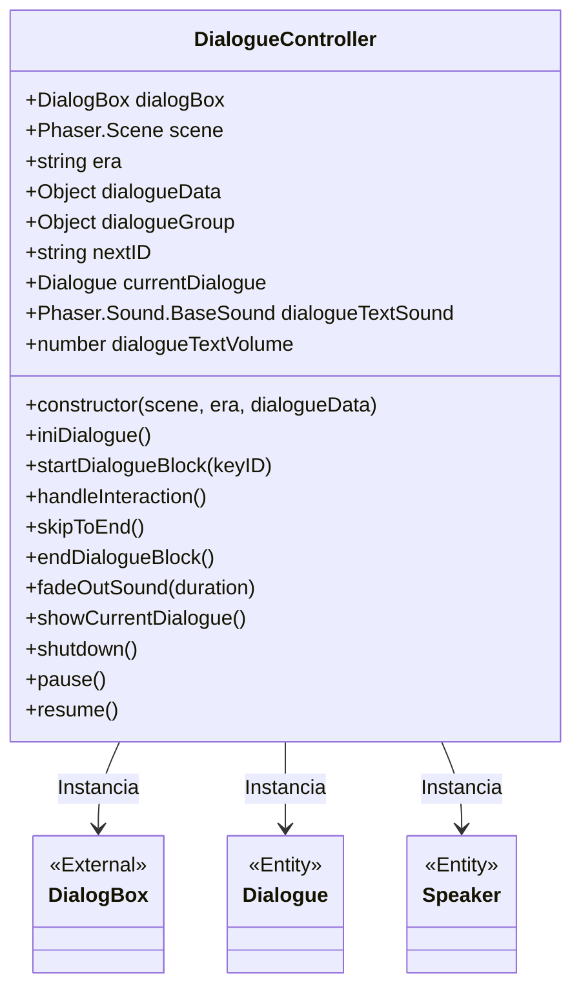
```mermaid
classDiagram
    class DialogueController {
        +DialogBox dialogBox
        +Phaser.Scene scene
        +string era
        +Object dialogueData
        +Object dialogueGroup
        +string nextID
        +Dialogue currentDialogue
        +Phaser.Sound.BaseSound dialogueTextSound
        +number dialogueTextVolume

        +constructor(scene, era, dialogueData)
        +iniDialogue()
        +startDialogueBlock(keyID)
        +handleInteraction()
        +skipToEnd()
        +endDialogueBlock()
        +fadeOutSound(duration)
        +showCurrentDialogue()
        +shutdown()
        +pause()
        +resume()
    }

    class DialogBox {
        <<External>>
    }
    class Dialogue {
        <<Entity>>
    }
    class Speaker {
        <<Entity>>
    }

    DialogueController --> DialogBox : Instancia
    DialogueController --> Dialogue : Instancia
    DialogueController --> Speaker : Instancia
```

#### **TransitionController**
Encargado de gestionar los efectos visuales al cambiar de escena (Fade In, Fade Out, etc.).

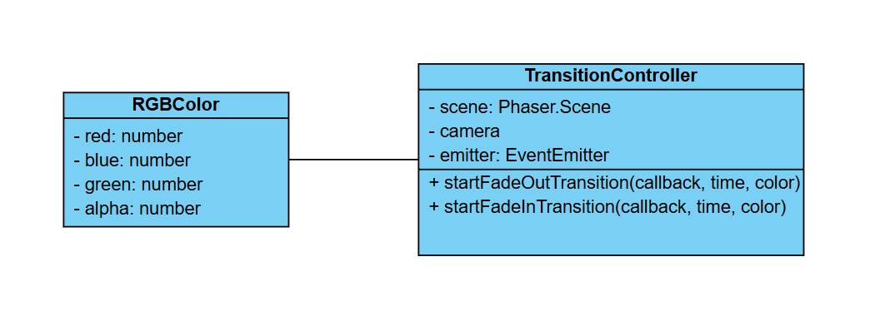

#### **SkipButton**
Un componente de UI que actúa como *Helper* del `DialogueController`, permitiendo saltar diálogos.

```mermaid
classDiagram
    class SkipButton {
        +DialogueController dialogueController
        +Object playerData

        +constructor(scene, x, y, dialogueController, playerData)
        +handlePointerOver()
        +handlePointerOut()
        +handlePointerDown()
    }

    class PhaserGameObjectImage {
        <<External>>
    }
    class DialogueController {
        <<Helper>>
    }

    SkipButton --|> PhaserGameObjectImage : Hereda
    SkipButton --> DialogueController : controls
```

### ⚙️ Managers y Utilidades

#### **AchievementManager**
Sistema centralizado para gestionar, desbloquear y guardar los logros del jugador.

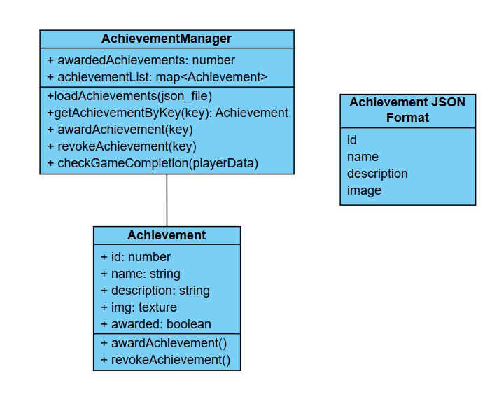

#### **RandomNumber**
Clase estática utilitaria para la generación de números aleatorios dentro de un intervalo específico.

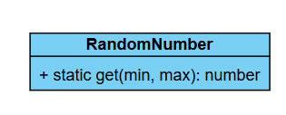

---

## 🎬 Escenas Principales

Estructura de las escenas base y menús de navegación del juego.

### **Base Scene**
Clase padre de la que heredan la mayoría de las escenas. Gestiona la música global, el menú de opciones y la detección de input básico.

### **Loading Scene**
Escena de carga inicial de assets.

### **Intro**
Cinemática o secuencia inicial del juego.

<strong>Ver Diagrama: Intro</strong>

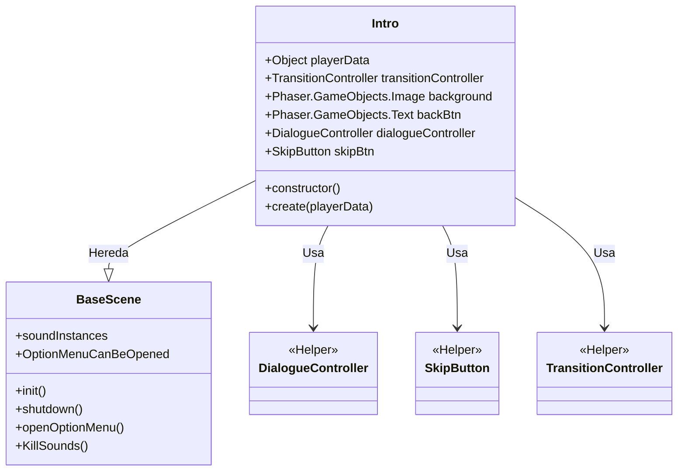
```mermaid
classDiagram
    class Intro {
        +Object playerData
        +TransitionController transitionController
        +Phaser.GameObjects.Image background
        +Phaser.GameObjects.Text backBtn
        +DialogueController dialogueController
        +SkipButton skipBtn

        +constructor()
        +create(playerData)
    }

    class BaseScene {
        +soundInstances
        +OptionMenuCanBeOpened
        +init()
        +shutdown()
        +openOptionMenu()
        +KillSounds()
    }

    class DialogueController {
        <<Helper>>
    }
    class SkipButton {
        <<Helper>>
    }
    class TransitionController {
        <<Helper>>
    }

    Intro --|> BaseScene : Hereda
    Intro --> DialogueController : Usa
    Intro --> SkipButton : Usa
    Intro --> TransitionController : Usa
```

### **Start**
Pantalla de título o "Press Start".

<strong>Ver Diagrama: Start</strong>

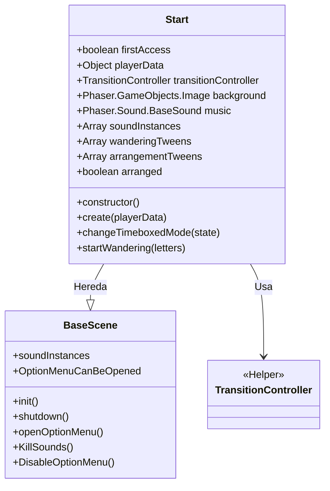
```mermaid
classDiagram
    class Start {
        +boolean firstAccess
        +Object playerData
        +TransitionController transitionController
        +Phaser.GameObjects.Image background
        +Phaser.Sound.BaseSound music
        +Array soundInstances
        +Array wanderingTweens
        +Array arrangementTweens
        +boolean arranged

        +constructor()
        +create(playerData)
        +changeTimeboxedMode(state)
        +startWandering(letters)
    }

    class BaseScene {
        +soundInstances
        +OptionMenuCanBeOpened
        +init()
        +shutdown()
        +openOptionMenu()
        +KillSounds()
        +DisableOptionMenu()
    }

    class TransitionController {
        <<Helper>>
    }

    Start --|> BaseScene : Hereda
    Start --> TransitionController : Usa
```

### **Credits Scene**
Créditos del equipo de desarrollo.

### **Settings Scene**
Configuración de audio y vídeo.

<strong>Ver Diagrama: Settings Scene</strong>

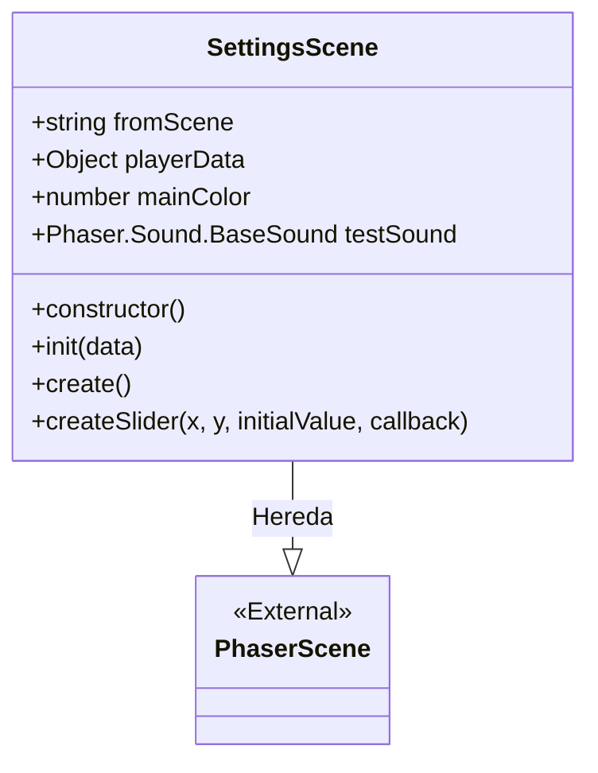
```mermaid
classDiagram
    class SettingsScene {
        +string fromScene
        +Object playerData
        +number mainColor
        +Phaser.Sound.BaseSound testSound

        +constructor()
        +init(data)
        +create()
        +createSlider(x, y, initialValue, callback)
    }

    class PhaserScene {
        <<External>>
    }

    SettingsScene --|> PhaserScene : Hereda
```

### **Option Menu Scene**
Menú de pausa accesible desde el juego.

<strong>Ver Diagrama: Option Menu Scene</strong>

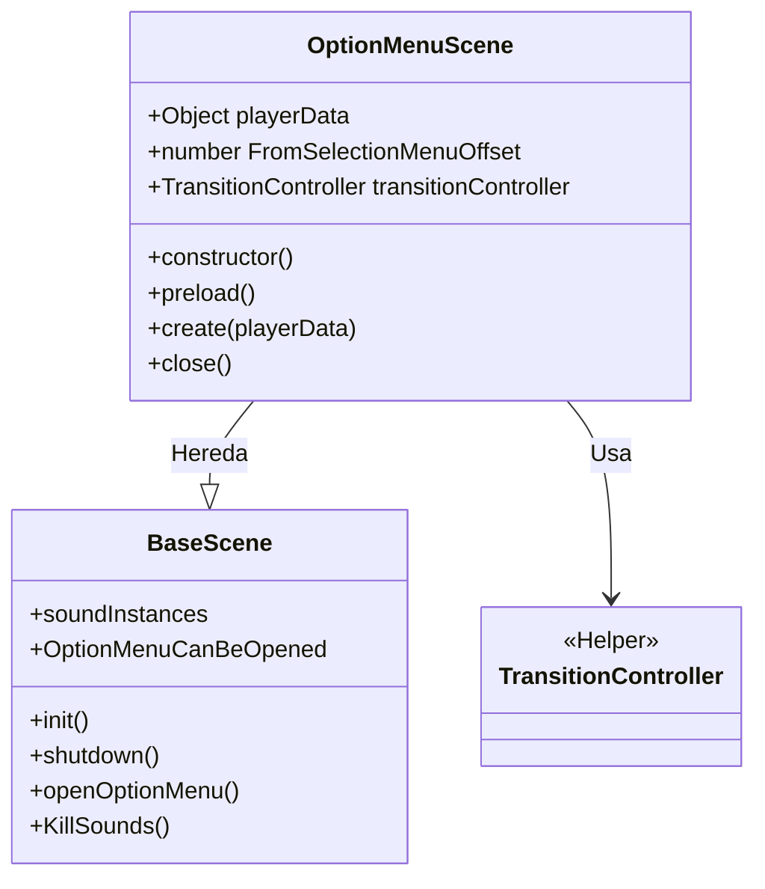
```mermaid
classDiagram
    class OptionMenuScene {
        +Object playerData
        +number FromSelectionMenuOffset
        +TransitionController transitionController

        +constructor()
        +preload()
        +create(playerData)
        +close()
    }

    class BaseScene {
        +soundInstances
        +OptionMenuCanBeOpened
        +init()
        +shutdown()
        +openOptionMenu()
        +KillSounds()
    }

    class TransitionController {
        <<Helper>>
    }

    OptionMenuScene --|> BaseScene : Hereda
    OptionMenuScene --> TransitionController : Usa
```

### **Help Lobby Scene**
Zona de ayuda o tutorial general.

<strong>Ver Diagrama: Help Lobby Scene</strong>

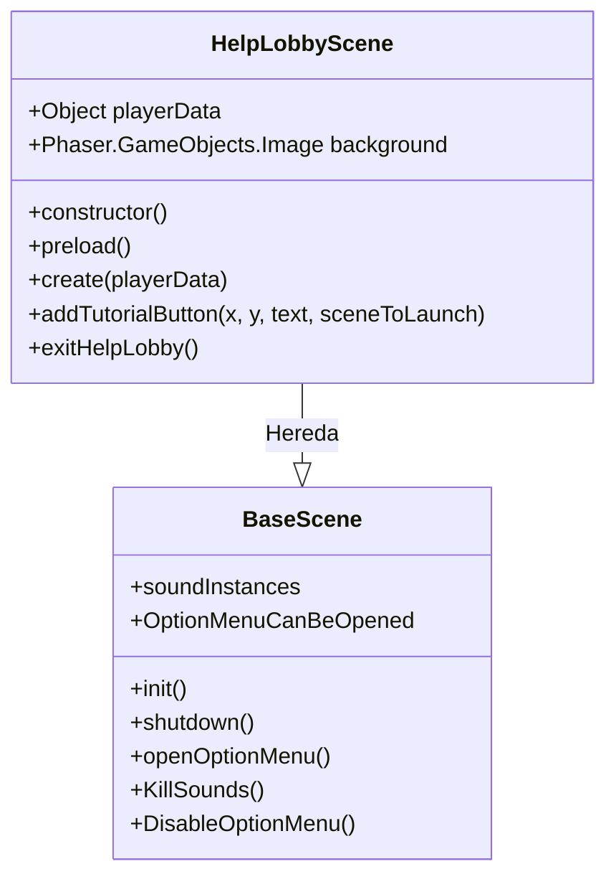
```mermaid
classDiagram
    class HelpLobbyScene {
        +Object playerData
        +Phaser.GameObjects.Image background

        +constructor()
        +preload()
        +create(playerData)
        +addTutorialButton(x, y, text, sceneToLaunch)
        +exitHelpLobby()
    }

    class BaseScene {
        +soundInstances
        +OptionMenuCanBeOpened
        +init()
        +shutdown()
        +openOptionMenu()
        +KillSounds()
        +DisableOptionMenu()
    }

    HelpLobbyScene --|> BaseScene : Hereda
```

### **Items Scene**
Galería de logros. Permite inspeccionar detalles de cada logro desbloqueado.

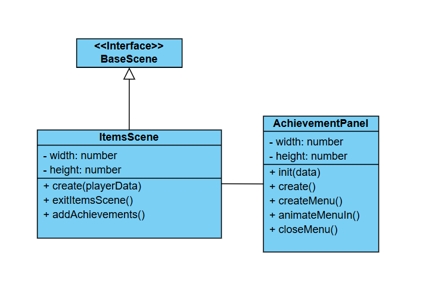

### **Confirm Menu Scene**
Pop-up genérico para confirmaciones (Sí/No).

### **Selection Menu Scene**
Hub central para seleccionar qué minijuego jugar.

<strong>Ver Diagrama: Selection Menu Scene</strong>

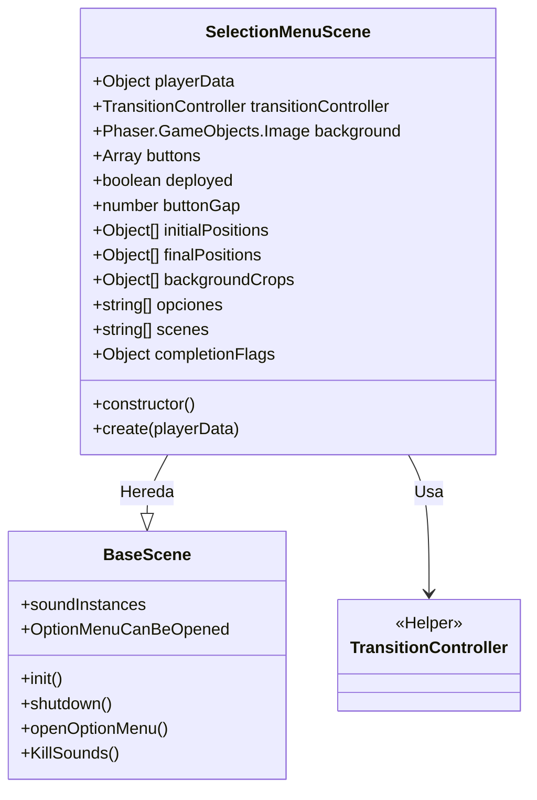
```mermaid
classDiagram
    class SelectionMenuScene {
        +Object playerData
        +TransitionController transitionController
        +Phaser.GameObjects.Image background
        +Array buttons
        +boolean deployed
        +number buttonGap
        +Object[] initialPositions
        +Object[] finalPositions
        +Object[] backgroundCrops
        +string[] opciones
        +string[] scenes
        +Object completionFlags

        +constructor()
        +create(playerData)
    }

    class BaseScene {
        +soundInstances
        +OptionMenuCanBeOpened
        +init()
        +shutdown()
        +openOptionMenu()
        +KillSounds()
    }

    class TransitionController {
        <<Helper>>
    }

    SelectionMenuScene --|> BaseScene : Hereda
    SelectionMenuScene --> TransitionController : Usa
```

### **Game Mode Selection Scene**
Selección de dificultad o modo de juego (Normal vs Timeboxed).

### **Game Completed**
Pantalla final tras completar el juego.

<strong>Ver Diagrama: Game Completed</strong>

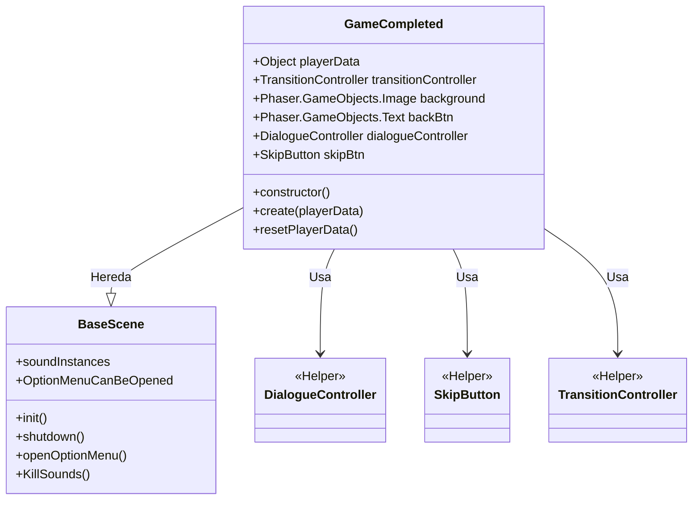
```mermaid
classDiagram
    class GameCompleted {
        +Object playerData
        +TransitionController transitionController
        +Phaser.GameObjects.Image background
        +Phaser.GameObjects.Text backBtn
        +DialogueController dialogueController
        +SkipButton skipBtn

        +constructor()
        +create(playerData)
        +resetPlayerData()
    }

    class BaseScene {
        +soundInstances
        +OptionMenuCanBeOpened
        +init()
        +shutdown()
        +openOptionMenu()
        +KillSounds()
    }

    class DialogueController {
        <<Helper>>
    }
    class SkipButton {
        <<Helper>>
    }
    class TransitionController {
        <<Helper>>
    }

    GameCompleted --|> BaseScene : Hereda
    GameCompleted --> DialogueController : Usa
    GameCompleted --> SkipButton : Usa
    GameCompleted --> TransitionController : Usa
```

### **TimeboxedDefeat**

---

## 🔄 Flujo General del Juego

A continuación se muestra el diagrama de flujo global que conecta todas las escenas principales, minijuegos y condiciones de victoria/derrota.

```mermaid
flowchart TD
    %% Nodos Principales
    Start([Pantalla Título / Start])
    Credits([Créditos])
    ModeSel[Selección de Modo / Dificultad]
    Intro[Intro Narrativa]
    SelMenu{Hub Central: Selección de Nivel}
    
    %% Nodos de Minijuegos (Simplificados)
    Aseb[Minijuego: Aseb - Egipto]
    Tali[Minijuego: Tali - Roma]
    Hanafuda[Minijuego: Hanafuda - Japón]
    
    %% Nodos Finales
    GameComp[Final del Juego]
    TBDefeat[Derrota Timeboxed]

    %% Flujo Inicial
    Start -->|Click Créditos| Credits
    Credits -->|Volver| Start
    Start -->|Click Jugar| ModeSel
    
    ModeSel -->|Primera vez| Intro
    ModeSel -->|Intro ya vista| SelMenu
    Intro -->|Terminar Intro| SelMenu

    %% Hub Central
    SelMenu -->|Elegir Egipto| Aseb
    SelMenu -->|Elegir Roma| Tali
    SelMenu -->|Elegir Japón| Hanafuda

    %% Lógica de Victoria (Retorno al Hub)
    Aseb -->|Victoria| SelMenu
    Tali -->|Victoria| SelMenu
    Hanafuda -->|Victoria| SelMenu

    %% Lógica de Derrota (Modo Normal)
    Aseb -->|Derrota Normal| SelMenu
    Tali -->|Derrota Normal| SelMenu
    Hanafuda -->|Derrota Normal| SelMenu

    %% Lógica de Derrota (Modo Timeboxed - Muerte Súbita)
    Aseb -.->|Derrota Timeboxed| TBDefeat
    Tali -.->|Derrota Timeboxed| TBDefeat
    Hanafuda -.->|Derrota Timeboxed| TBDefeat
    TBDefeat -->|Game Over / Reinicio| Start

    %% Final del Juego
    SelMenu -- Verificación Automática --> Check{¿Todo Completado?}
    Check -->|Sí| GameComp
    Check -->|No| SelMenu
    GameComp -->|Ver Créditos| Credits
```

---

## 🎮 Minijuegos

### 🏺 Aseb (Egipto)

El juego de mesa del Senet/Aseb contra Anubis.

#### 📋 Listado de Escenas

*   **`IntroAsebScene`**: Introducción narrativa. Encuentro con Anubis. (Diálogos + SkipButton).
*   **`TutorialAsebScene`**: Explicación de las reglas. (Diálogos + SkipButton).
*   **`AsebBeginScene`**: Minijuego de "tirar los palos" para decidir quién empieza.
*   **`AsebScene`**: La escena principal del juego de tablero (Gameplay).
*   **`AsebVictoryScene`**: Narrativa tras ganar la partida.
*   **`AsebDefeatScene`**: Narrativa tras perder la partida.

#### 🔀 Flujo de Escenas (Flowchart)

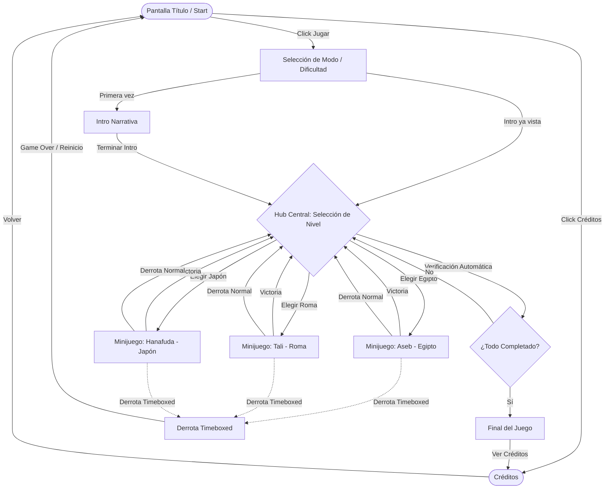
```mermaid
flowchart TD
    %% Nodos Principales
    Start([Pantalla Título / Start])
    Credits([Créditos])
    ModeSel[Selección de Modo / Dificultad]
    Intro[Intro Narrativa]
    SelMenu{Hub Central: Selección de Nivel}
    
    %% Nodos de Minijuegos (Simplificados)
    Aseb[Minijuego: Aseb - Egipto]
    Tali[Minijuego: Tali - Roma]
    Hanafuda[Minijuego: Hanafuda - Japón]
    
    %% Nodos Finales
    GameComp[Final del Juego]
    TBDefeat[Derrota Timeboxed]

    %% Flujo Inicial
    Start -->|Click Créditos| Credits
    Credits -->|Volver| Start
    Start -->|Click Jugar| ModeSel
    
    ModeSel -->|Primera vez| Intro
    ModeSel -->|Intro ya vista| SelMenu
    Intro -->|Terminar Intro| SelMenu

    %% Hub Central
    SelMenu -->|Elegir Egipto| Aseb
    SelMenu -->|Elegir Roma| Tali
    SelMenu -->|Elegir Japón| Hanafuda

    %% Lógica de Victoria (Retorno al Hub)
    Aseb -->|Victoria| SelMenu
    Tali -->|Victoria| SelMenu
    Hanafuda -->|Victoria| SelMenu

    %% Lógica de Derrota (Modo Normal)
    Aseb -->|Derrota Normal| SelMenu
    Tali -->|Derrota Normal| SelMenu
    Hanafuda -->|Derrota Normal| SelMenu

    %% Lógica de Derrota (Modo Timeboxed - Muerte Súbita)
    Aseb -.->|Derrota Timeboxed| TBDefeat
    Tali -.->|Derrota Timeboxed| TBDefeat
    Hanafuda -.->|Derrota Timeboxed| TBDefeat
    TBDefeat -->|Game Over / Reinicio| Start

    %% Final del Juego
    SelMenu -- Verificación Automática --> Check{¿Todo Completado?}
    Check -->|Sí| GameComp
    Check -->|No| SelMenu
    GameComp -->|Ver Créditos| Credits
```

#### 📐 Diagramas de Arquitectura (Escenas)

<strong>Ver Diagrama: IntroAseb</strong>

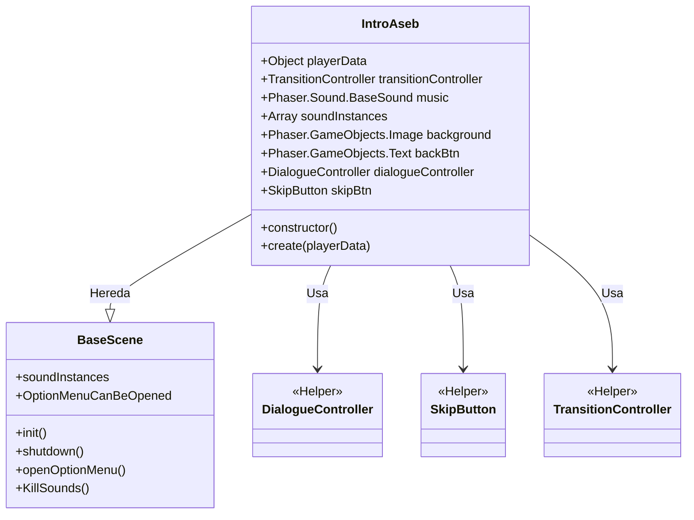
```mermaid
classDiagram
    class IntroAseb {
        %% Properties defined in create
        +Object playerData
        +TransitionController transitionController
        +Phaser.Sound.BaseSound music
        +Array soundInstances
        +Phaser.GameObjects.Image background
        +Phaser.GameObjects.Text backBtn
        +DialogueController dialogueController
        +SkipButton skipBtn
        
        %% Methods
        +constructor()
        +create(playerData)
    }

    class BaseScene {
        +soundInstances
        +OptionMenuCanBeOpened
        +init()
        +shutdown()
        +openOptionMenu()
        +KillSounds()
    }

    class DialogueController {
        <<Helper>>
    }
    class SkipButton {
        <<Helper>>
    }

    class TransitionController {
         <<Helper>>
    }

    IntroAseb --|> BaseScene : Hereda
    IntroAseb --> DialogueController : Usa
    IntroAseb --> SkipButton : Usa
    IntroAseb --> TransitionController : Usa
```

<strong>Ver Diagrama: TutorialAseb</strong>

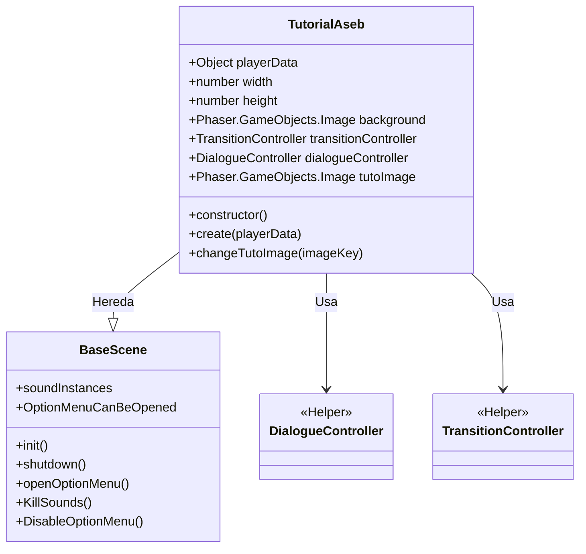
```mermaid
classDiagram
    class TutorialAseb {
        %% Properties defined in create
        +Object playerData
        +number width
        +number height
        +Phaser.GameObjects.Image background
        +TransitionController transitionController
        +DialogueController dialogueController
        +Phaser.GameObjects.Image tutoImage

        %% Methods
        +constructor()
        +create(playerData)
        +changeTutoImage(imageKey)
    }

    class BaseScene {
        +soundInstances
        +OptionMenuCanBeOpened
        +init()
        +shutdown()
        +openOptionMenu()
        +KillSounds()
        +DisableOptionMenu()
    }

    class DialogueController {
        <<Helper>>
    }

    class TransitionController {
        <<Helper>>
    }

    TutorialAseb --|> BaseScene : Hereda
    TutorialAseb --> DialogueController : Usa
    TutorialAseb --> TransitionController : Usa

```

<strong>Ver Diagrama: AsebBeginScene</strong>

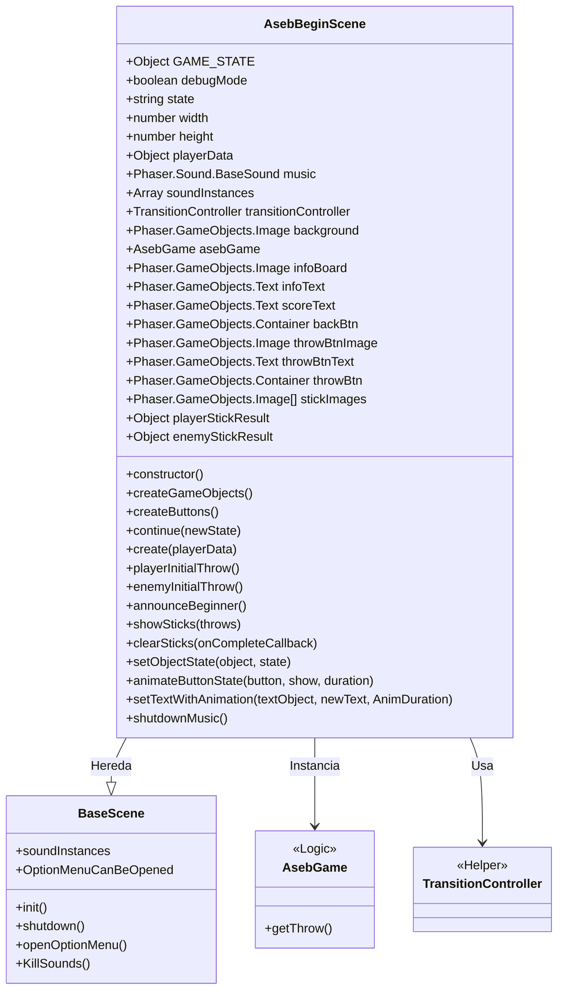
```mermaid
classDiagram
    class AsebBeginScene {
        %% Properties defined in constructor
        +Object GAME_STATE
        +boolean debugMode
        +string state

        %% Properties defined in create
        +number width
        +number height
        +Object playerData
        +Phaser.Sound.BaseSound music
        +Array soundInstances
        +TransitionController transitionController
        +Phaser.GameObjects.Image background
        +AsebGame asebGame
        
        %% UI Objects
        +Phaser.GameObjects.Image infoBoard
        +Phaser.GameObjects.Text infoText
        +Phaser.GameObjects.Text scoreText
        +Phaser.GameObjects.Container backBtn
        +Phaser.GameObjects.Image throwBtnImage
        +Phaser.GameObjects.Text throwBtnText
        +Phaser.GameObjects.Container throwBtn
        +Phaser.GameObjects.Image[] stickImages

        %% Logic variables
        +Object playerStickResult
        +Object enemyStickResult

        %% Methods
        +constructor()
        +createGameObjects()
        +createButtons()
        +continue(newState)
        +create(playerData)
        +playerInitialThrow()
        +enemyInitialThrow()
        +announceBeginner()
        +showSticks(throws)
        +clearSticks(onCompleteCallback)
        +setObjectState(object, state)
        +animateButtonState(button, show, duration)
        +setTextWithAnimation(textObject, newText, AnimDuration)
        +shutdownMusic()
    }

    class BaseScene {
        +soundInstances
        +OptionMenuCanBeOpened
        +init()
        +shutdown()
        +openOptionMenu()
        +KillSounds()
    }

    class AsebGame {
        <<Logic>>
        +getThrow()
    }

    class TransitionController {
         <<Helper>>
    }

    AsebBeginScene --|> BaseScene : Hereda
    AsebBeginScene --> AsebGame : Instancia
    AsebBeginScene --> TransitionController : Usa

```

<strong>Ver Diagrama: AsebScene (Gameplay Principal)</strong>

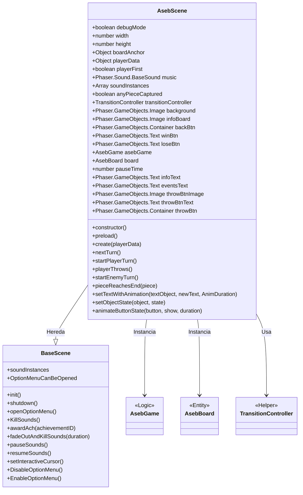
```mermaid
classDiagram
    class AsebScene {
        %% Properties defined in constructor
        +boolean debugMode
        
        %% Properties defined in preload/create
        +number width
        +number height
        +Object boardAnchor
        +Object playerData
        +boolean playerFirst
        +Phaser.Sound.BaseSound music
        +Array soundInstances
        +boolean anyPieceCaptured
        +TransitionController transitionController
        +Phaser.GameObjects.Image background
        +Phaser.GameObjects.Image infoBoard
        +Phaser.GameObjects.Container backBtn
        +Phaser.GameObjects.Text winBtn
        +Phaser.GameObjects.Text loseBtn
        +AsebGame asebGame
        +AsebBoard board
        +number pauseTime
        +Phaser.GameObjects.Text infoText
        +Phaser.GameObjects.Text eventsText
        +Phaser.GameObjects.Image throwBtnImage
        +Phaser.GameObjects.Text throwBtnText
        +Phaser.GameObjects.Container throwBtn

        %% Methods
        +constructor()
        +preload()
        +create(playerData)
        +nextTurn()
        +startPlayerTurn()
        +playerThrows()
        +startEnemyTurn()
        +pieceReachesEnd(piece)
        +setTextWithAnimation(textObject, newText, AnimDuration)
        +setObjectState(object, state)
        +animateButtonState(button, show, duration)
    }

    class BaseScene {
        +soundInstances
        +OptionMenuCanBeOpened
        +init()
        +shutdown()
        +openOptionMenu()
        +KillSounds()
        +awardAch(achievementID)
        +fadeOutAndKillSounds(duration)
        +pauseSounds()
        +resumeSounds()
        +setInteractiveCursor()
        +DisableOptionMenu()
        +EnableOptionMenu()
    }

    class AsebGame {
        <<Logic>>
    }

    class AsebBoard {
        <<Entity>>
    }

    class TransitionController {
         <<Helper>>
    }

    AsebScene --|> BaseScene : Hereda
    AsebScene --> AsebGame : Instancia
    AsebScene --> AsebBoard : Instancia
    AsebScene --> TransitionController : Usa

```

<strong>Ver Diagrama: AsebVictoryScene</strong>

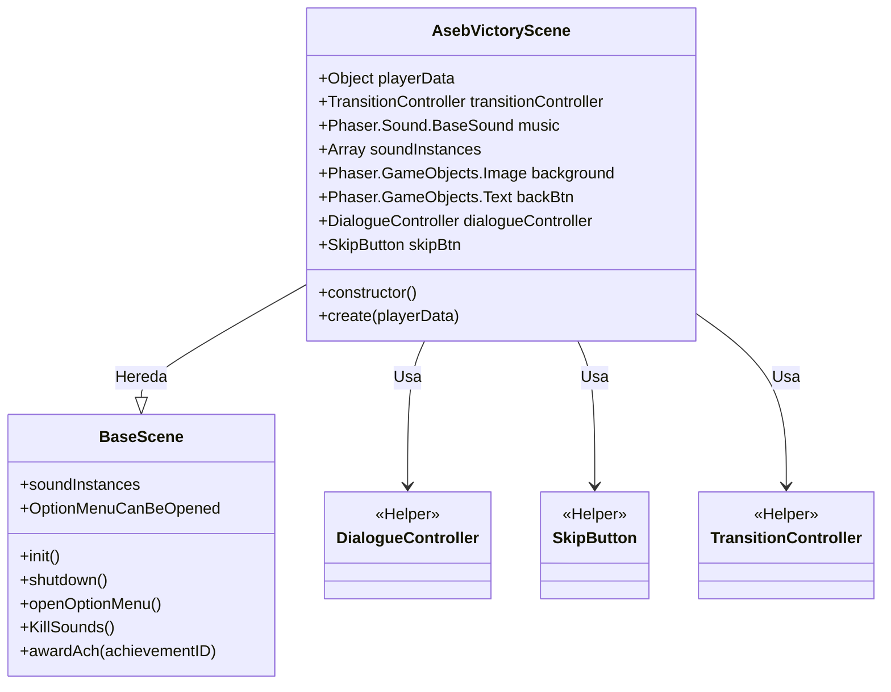
```mermaid
classDiagram
    class AsebVictoryScene {
        %% Properties defined in create
        +Object playerData
        +TransitionController transitionController
        +Phaser.Sound.BaseSound music
        +Array soundInstances
        +Phaser.GameObjects.Image background
        +Phaser.GameObjects.Text backBtn
        +DialogueController dialogueController
        +SkipButton skipBtn

        %% Methods
        +constructor()
        +create(playerData)
    }

    class BaseScene {
        +soundInstances
        +OptionMenuCanBeOpened
        +init()
        +shutdown()
        +openOptionMenu()
        +KillSounds()
        +awardAch(achievementID)
    }

    class DialogueController {
        <<Helper>>
    }
    class SkipButton {
        <<Helper>>
    }

    class TransitionController {
         <<Helper>>
    }

    AsebVictoryScene --|> BaseScene : Hereda
    AsebVictoryScene --> DialogueController : Usa
    AsebVictoryScene --> SkipButton : Usa
    AsebVictoryScene --> TransitionController : Usa


```

<strong>Ver Diagrama: AsebDefeatScene</strong>

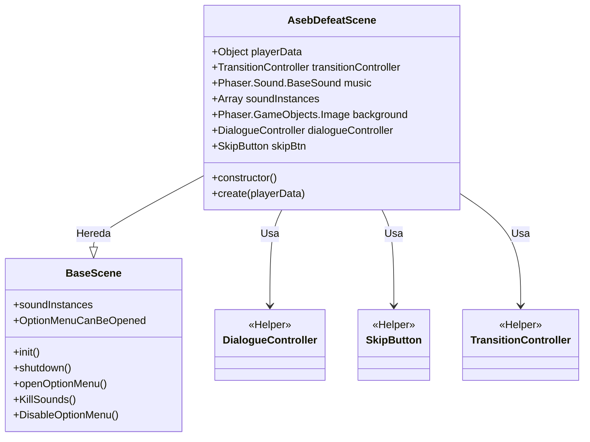
```mermaid
classDiagram
    class AsebDefeatScene {
        %% Properties defined in create
        +Object playerData
        +TransitionController transitionController
        +Phaser.Sound.BaseSound music
        +Array soundInstances
        +Phaser.GameObjects.Image background
        +DialogueController dialogueController
        +SkipButton skipBtn

        %% Methods
        +constructor()
        +create(playerData)
    }

    class BaseScene {
        +soundInstances
        +OptionMenuCanBeOpened
        +init()
        +shutdown()
        +openOptionMenu()
        +KillSounds()
        +DisableOptionMenu()
    }

    class DialogueController {
        <<Helper>>
    }
    class SkipButton {
        <<Helper>>
    }

    class TransitionController {
         <<Helper>>
    }

    AsebDefeatScene --|> BaseScene : Hereda
    AsebDefeatScene --> DialogueController : Usa
    AsebDefeatScene --> SkipButton : Usa
    AsebDefeatScene --> TransitionController : Usa
```

#### 🧩 Clases de Lógica y Entidades (Aseb)

A continuación se detallan las clases que manejan la lógica interna y los elementos del tablero de Aseb.

**AsebGame (Controlador Lógico)**
Encargado de los turnos, estado de la partida y condiciones de victoria.

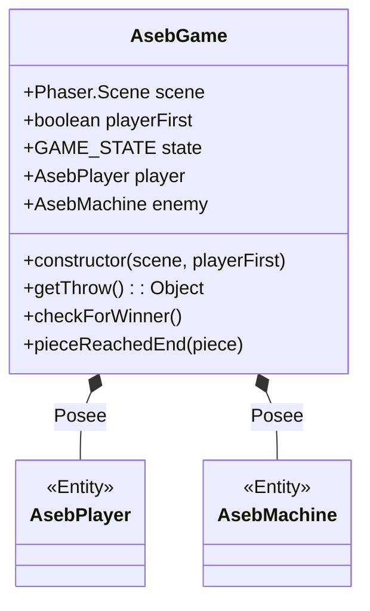
```mermaid
classDiagram
    class AsebGame {
        +Phaser.Scene scene
        +boolean playerFirst
        +GAME_STATE state
        +AsebPlayer player
        +AsebMachine enemy
        
        +constructor(scene, playerFirst)
        +getThrow() : Object
        +checkForWinner()
        +pieceReachedEnd(piece)
    }

    class AsebPlayer {
        <<Entity>>
    }
    class AsebMachine {
        <<Entity>>
    }

    AsebGame *-- AsebPlayer : Posee
    AsebGame *-- AsebMachine : Posee
```

**AsebBoard (Tablero)**
Maneja la cuadrícula, las posiciones válidas y la colección de fichas.

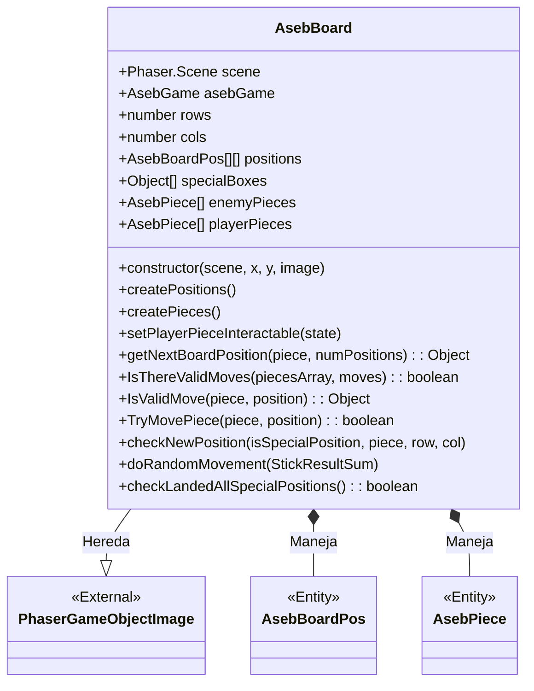
```mermaid
classDiagram
    class AsebBoard {
        +Phaser.Scene scene
        +AsebGame asebGame
        +number rows
        +number cols
        +AsebBoardPos[][] positions
        +Object[] specialBoxes
        +AsebPiece[] enemyPieces
        +AsebPiece[] playerPieces

        +constructor(scene, x, y, image)
        +createPositions()
        +createPieces()
        +setPlayerPieceInteractable(state)
        +getNextBoardPosition(piece, numPositions) : Object
        +IsThereValidMoves(piecesArray, moves) : boolean
        +IsValidMove(piece, position) : Object
        +TryMovePiece(piece, position) : boolean
        +checkNewPosition(isSpecialPosition, piece, row, col)
        +doRandomMovement(StickResultSum)
        +checkLandedAllSpecialPositions() : boolean
    }

    class AsebBoardPos {
        <<Entity>>
    }
    class AsebPiece {
        <<Entity>>
    }
    class PhaserGameObjectImage {
        <<External>>
    }

    AsebBoard --|> PhaserGameObjectImage : Hereda
    AsebBoard *-- AsebBoardPos : Maneja
    AsebBoard *-- AsebPiece : Maneja
```

**AsebBoardPos (Casilla)**
Representa una celda individual en el tablero.

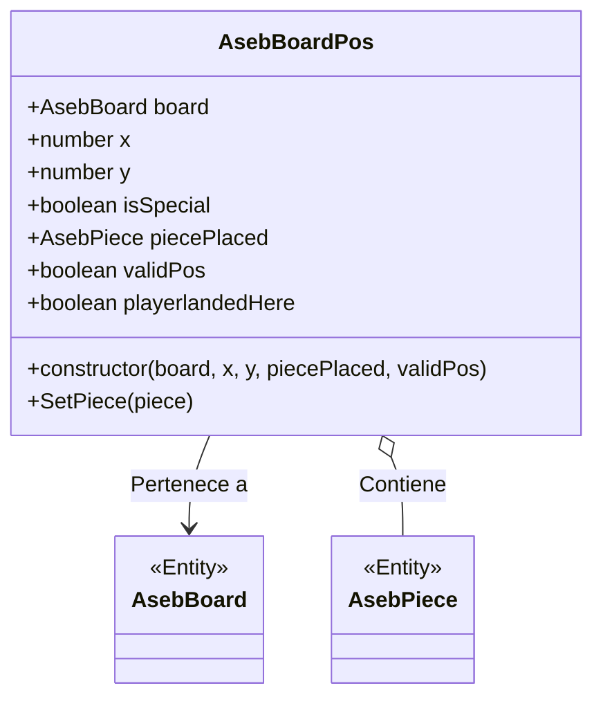
```mermaid
classDiagram
    class AsebBoardPos {
        +AsebBoard board
        +number x
        +number y
        +boolean isSpecial
        +AsebPiece piecePlaced
        +boolean validPos
        +boolean playerlandedHere
        
        +constructor(board, x, y, piecePlaced, validPos)
        +SetPiece(piece)
    }

    class AsebBoard {
        <<Entity>>
    }
    class AsebPiece {
        <<Entity>>
    }

    AsebBoardPos --> AsebBoard : Pertenece a
    AsebBoardPos o-- AsebPiece : Contiene
```

**AsebPiece (Ficha)**
Representa la ficha del jugador o del enemigo. Hereda de `Phaser.GameObjects.Image`.

```mermaid
classDiagram
    class AsebPiece {
        +PIECE_TYPE type
        +Object SpawnPoint
        +AsebBoard board
        +Object boardPos
        +boolean movable
        +Phaser.Tweens.Tween idleTween

        +constructor(scene, x, y, image, board, type)
        +setIdleAnimation(animate)
        +onClick()
        +setBoardVariables(row, col)
        +MoveInScreen(x, y, IsSpecialPosition, row, col, AnimDuration)
        +setInteractable(state, moves)
        +ReturnToSpawn()
        +Ended() : boolean
    }

    class AsebBoard {
        <<Entity>>
    }
    class PhaserGameObjectImage {
        <<External>>
    }

    AsebPiece --|> PhaserGameObjectImage : Hereda
    AsebPiece --> AsebBoard : Referencia
```

**AsebPlayer & AsebMachine (Entidades)**
Clases de datos simples para almacenar el estado de puntuación.

```mermaid
classDiagram
    class AsebPlayer {
        +number actualStickResult
        +number winningPieces
        
        +constructor()
    }
```

```mermaid
classDiagram
    class AsebMachine {
        +number actualStickResult
        +number winningPieces
        
        +constructor()
    }
```

---

### 🎲 Tali (Roma)

Todas las escenas del juego Tali.

#### Listado de Escenas
*   **TaliIntroScene**: La escena de introducción. Contiene solo los diálogos.
*   **TaliTutorialScene**: La escena que contiene el tutorial para Tali.
*   **TaliBeginScene**: La escena donde se determina el jugador que empieza.
*   **TaliScene**: La escena del propio juego.
*   **DistractMercuryScene**: La escena donde el jugador intenta distraer a Mercury.
*   **CombinationMenu**: La escena donde se muestran las posibles combinaciones. Aparece encima de la escena del juego.
*   **TaliEndScene**: La escena final del juego.

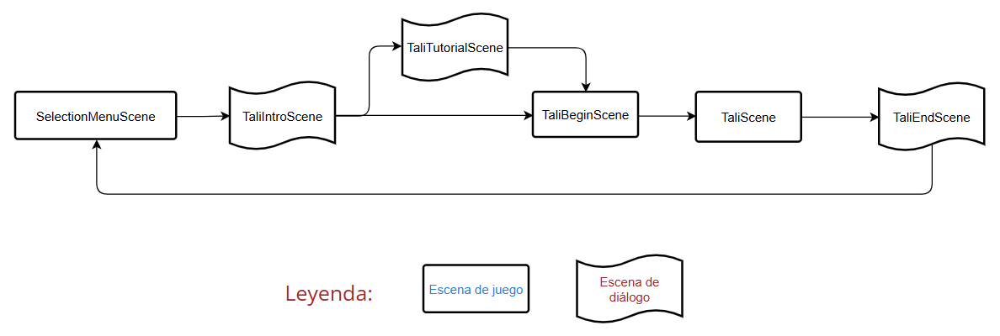
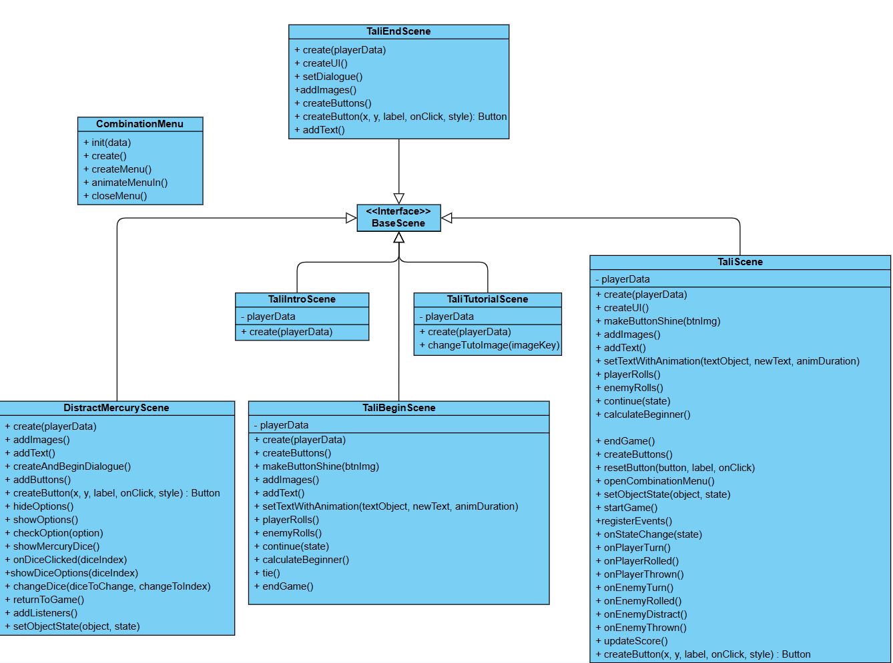

---

### 🎴 Hanafuda (Japón)

---
