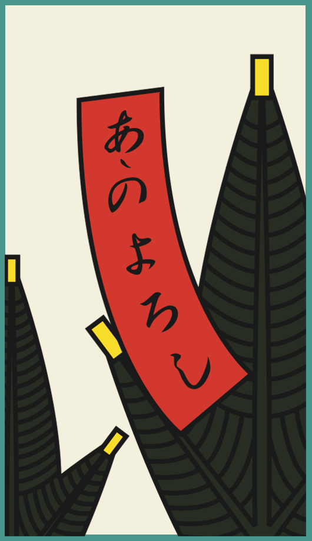

# 🎨 Assets del Juego

Este documento detalla los assets **no originales** utilizados en el juego **TimeBoxed**, su descripción y origen.

> ℹ️ **Nota:** Los assets originales (creados por el equipo de desarrollo) son omitidos en este listado.
>
> Los assets originales están bajo licencia [Creative Commons Attribution-NonCommercial 4.0 International](https://creativecommons.org/licenses/by-nc/4.0/) (CC BY-NC 4.0).

---

## 📑 Índice

1. [Decisiones de Dirección Artística](#-decisiones-de-dirección-artística)
2. [Listado de Assets](#-listado-de-assets)
    - [Assets Gráficos](#-assets-gráficos)
    - [Assets de Audio](#-assets-de-audio)

---

## 🖌️ Decisiones de Dirección Artística

El estilo artístico del juego se basa en la cultura del **manga y el anime** para los personajes, mientras que los paisajes se inspiran en un estilo de pinceladas y *concept art*.

Desde el punto de vista artístico, el juego adopta un estilo visual en **2D con líneas marcadas**, lo que aporta claridad a las ilustraciones. Además, en cada era se incorporan elementos gráficos propios de su mitología para ofrecer una representación única y reconocible para el jugador.

---

## 📦 Listado de Assets

### 🖼️ Assets Gráficos

#### **AsebBoard.png**
*   **Descripción:** Tablero de juego utilizado en la escena de Aseb (Egipto).
*   **Origen:** Imagen original obtenida de [Amazon](https://www.amazon.com/-/es/Generic-Egipto-guerra-Antiguo-jugadores/dp/B0C9W1V7JR).
*   **Modificaciones:** La imagen sufrió modificaciones artísticas significativas; fue modificada para remover la madera del tablero y dejar únicamente las casillas con los iconos.

#### **Hanafuda Cards (Ejemplos)**
*   **Descripción:** Cartas del juego Hanafuda utilizadas en la escena de Hanafuda (Japón). *(No se incluyen todas las cartas para no extender el documento)*.
*   **Modificaciones:** Las cartas sufrieron ligeras modificaciones artísticas.
*   **Licencia:** Creative Commons Attribution-ShareAlike 4.0 International (CC BY-SA 4.0) - [FudaWiki](https://fudawiki.org/en/hanafuda)

| Carta 0 | Carta 1 |
| :---: | :---: |
|  |  |

#### **SettingsIcon.png y SettingsIconHovered.png**
*   **Descripción:** Icono de ajustes y su variante al pasar el cursor, utilizados en el menú de opciones.
*   **Origen:** [Flaticon](https://www.flaticon.com/free-icon/gear_1160356)
*   **Licencia:** Licencia de Flaticon (Gratis para uso personal y comercial con atribución).
*   **Modificaciones:** La imagen fue alterada.

| Normal | Hovered |
| :---: | :---: |
|  |  |

#### **Gatos graciosos (Créditos)**
*   **Archivos:** `alienCat.jpg`, `awkwarCat.jpg`, `mewingCat.jpg`, `oreoCat.jpg`
*   **Descripción:** Imágenes/memes de gatos utilizadas en la escena de Créditos para representar a los miembros del equipo.
*   **Nota:** Al ser imágenes compartidas por todo internet, es difícil encontrar su origen y licencia exacta.

| Alien Cat | Awkward Cat | Mewing Cat | Oreo Cat |
| :---: | :---: | :---: | :---: |
|  |  |  |  |

---

### 🎵 Assets de Audio

| Archivo | Descripción | Ubicación | Licencia / Origen |
| :--- | :--- | :--- | :--- |
| **ButtonHover.wav** | Efecto de sonido genérico al pasar el cursor sobre botones. | Múltiples escenas (Menú Principal, Selección, Opciones, etc.). | Libre de uso ([Pixabay](https://pixabay.com/sound-effects/minimalist-button-hover-sound-effect-399749/)) |
| **DialogueTextSFX.mp3** | Efecto de sonido que acompaña la aparición de texto en los cuadros de diálogo. | Escenas de diálogo (Intro, Tutoriales, Finales). | Libre de uso ([ZapSplat](https://www.zapsplat.com/music/data-readout-computer-printing-text-on-screen-burst-2/?registration_redirect=1&item_id=7889#)) |
| **BoxClickedSFX.mp3** | Sonido al interactuar con las cajas. | Escena del Menú de Selección de Nivel. | Libre de uso ([Pixabay](https://pixabay.com/es/sound-effects/air-blow-380645/)) |
| **TextPop.mp3** | Aparece cuando se muestra texto o notificaciones en el tablero. | Escenas de juego de Aseb y Tali. | Libre de uso ([Pixabay](https://pixabay.com/sound-effects/click-sound-432501/)) |
| **HappyNeighborhood.mp3** | Música de fondo para la narrativa inicial. | Escena de Introducción. | Libre de uso ([YouTube](https://www.youtube.com/watch?v=c-ymtReBAo4)) |
| **ChooseYourEra.mp3** | Música de fondo para la selección de era. | Escena del Menú de Selección de Nivel. | Con derechos de autor ([YouTube](https://www.youtube.com/watch?v=SwUpMhp-DEc)) |
| **japanese.mp3** | Música de fondo para la sección de Japón. | Escenas de Hanafuda. | - |
| **TaliIntroMusic.mp3** | Música de introducción para el juego de Roma. | Escena de Introducción de Tali. | [Adrian von Zigler](https://www.youtube.com/channel/UCSeJA6az0GrNM4_-pl3HQSQ), CC BY-NC-ND, permite el uso no-comercial de la obra |
| **TaliGameMusic.mp3** | Música de fondo durante la partida. | Escena de Juego de Tali. | [Sebastien Angel Epic Music Composer](https://www.youtube.com/c/S%C3%A9bastienAngel), CC BY-NC-ND, permite el uso no-comercial de la obra |

---

  <a href="https://maltengd.github.io/TimeBoxed/">Timeboxed</a> © 2025 by <a href="https://github.com/MaltenGD/TimeBoxed">PopCat Games</a> 
  Licensed under <a href="https://creativecommons.org/licenses/by-nc/4.0/">CC BY-NC 4.0</a> 
  
  
  

